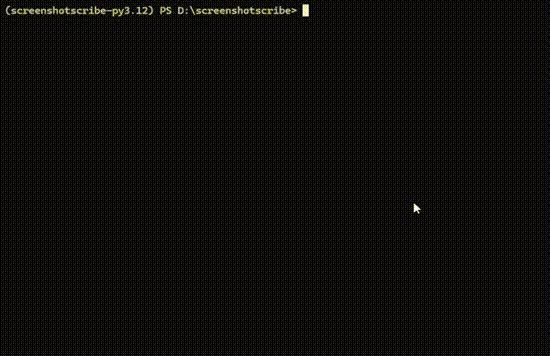

<!-- PROJECT LOGO -->
<br />
<div align="center">
  <a href="https://github.com/yuandere/screenshotscribe">
    
  </a>

  <h2 align="center">Screenshot Scribe</h2>

  <p align="center">
    Perform batch OCR processing on your images and screenshots, and gather the text into one formatted file with Gemini 1.5 Flash.
    <br />
    <br />
  </p>
</div>

<!-- ABOUT -->

## About

<div align="center">
  <a href="https://github.com/yuandere/screenshotscribe">
    
  </a>
</div>

Ever take lots of screenshots or bookmarks to reference later but never actually do? This tool is intended to make processing text from those images and screenshots much easier.

Gemini 1.5 Flash was chosen for the job since it greatly outperforms open-source OCR solutions like Tesseract and EasyOCR, but is [quicker](https://arxiv.org/abs/2403.05530) and [free/cheaper](https://llmpricecheck.com/) relative to many other multimodal LLMs.

<!-- FEATURES -->

## Features

- Batch OCR processing of images
- Easy to customize system prompt
- `.json` output by default, with optional formatted `.md` and `.docx` file types

<!-- GETTING STARTED -->

## Getting Started

### Prerequisites

You will need to have the following:

- [Python 3.12 or up](https://www.python.org/)
- [uv](https://docs.astral.sh/uv/)
- [Free API key from Google AI Studio](https://aistudio.google.com/)

### Installation

1. Clone the repo
   ```sh
   git clone https://github.com/yuandere/screenshotscribe
   ```
2. Create a `.env` file in the project directory and add your API key
   ```
   GEMINI_API_KEY = XXXXXX
   ```
3. Move any images you want processed into the folder /images_to_process
4. Run 
   ```
   uv screenshotscribe
   ```


<!-- CONTRIBUTING -->

## Contributing

Contributions are welcome. Feel free to create a pull request or submit an issue for new features, fixing bugs, or improving documentation.

## License

Distributed under the MIT License. See `LICENSE.txt` for more information.

<!-- ACKNOWLEDGMENTS -->

## Acknowledgments

- [flaticon](https://www.flaticon.com/free-icon/generative-image_16649299)
